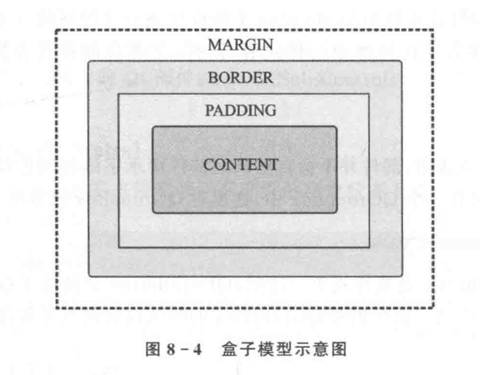

# 界面外观

```
QStyle
QPalette
Qt样式表 (Qt Style Sheets)
不规则窗体和透明窗体的实现方法
```

## Qt风格

调色板 QPalette类，包含了部件各种状态的颜色组，一个调色板有三种状态：激活，失效，非激活。Qt中所有部件都包含一个调色板，并且使用各自的调色板绘制它们自身。

- 激活颜色组 QPalette::Activate，用于获得键盘焦点的窗口
- 非激活颜色组QPalette::Inactivate，用于其他没有获得键盘焦点的窗口
- 失效颜色组QPalette::Disabled，用于因为某些原因而不可用的部件（不是窗口）

## Qt样式表

是一个可以自定义部件外观的十分强大的机制

除了那些能够通过子类化QStyle更改的外观，其余的都可以使用Qt样式表来美化。Qt样式表搜到HTML的层叠样式表 (CSS) 的启发，不同于CSS不同的是，Qt样式表应用于部件。

```
QApplication::setStyleSheet()
QWidget::setStyleSheet()
```

不同级别都设置了样式表的话，那么Qt会使用所有有效的样式表，这被称为样式表的层叠。

### 样式表语法

Qt样式表的术语和语法规则与HTML CSS基本相同

1. 样式规则

```
选择器(selector) + 声明(declaration)
```

选择器 指定受该规则影响的部件

声明 指定了这个部件上要设置的属性

```
QPushButton{color:red}

其中，QPushButton是选择器，{color:red}是声明
color是属性，（一般不区分大小写）
red是值
```


```
QPushButton,QLineEdit,QComboBox{color:red}

QPushButton{color:red;background-color:white}
```

2. 选择器类型

```
* 通用选择器，匹配所有部件
类型选择器 QPushButton QLineEdit QComboBox ...
属性选择器 QPushButton[flat="false"]
类选择器 .QPushButton (与类型选择器不同，不包含它的子类)
ID选择器 QPushButton#okButton 对象名
后代选择器 QDialog QPushButton 只要是QDialog的子部件
孩子选择器 QDialog>QPushButton 直接子部件
```

3. 子控件

复杂的部件，需要访问他们的子控件，如`QComboBox`，的下拉按钮，`QSpinBox`的向上和向下箭头等等。

```
QComboBox::drop-down{image:url(dropdown.png)}
```

4. 伪状态

限制规则在指定的状态上应用

```
QPushButton:hover{color:white}

QRadioButton:!hover{color:red} // 非hover状态时应用声明

QCheckBox:hover:checke{color:white} // 逻辑 与

QCheckBox:hover,QCheckBox:checked{color:white} // 逻辑 或

QComboBox:drop-down:hover{image:url(dropdown_bright.png)}
```

5. 冲突解决

6. 层叠
7. 继承

部件并不会自动从父部件继承颜色和字体的设置

```
qApp->setStyleSheet("QGroupBox{color:red}");

qApp->setStyleSheet("QGroupBox, QGroupBox *{color:red}");
```

8. 设置`QObject`属性

？？？

### 自定义不见外观和换肤

1. 盒子模型

每个部件都可以被看作拥有4个同心矩形的盒子。



## 特殊效果窗体

部件遮罩来实现不规则窗体